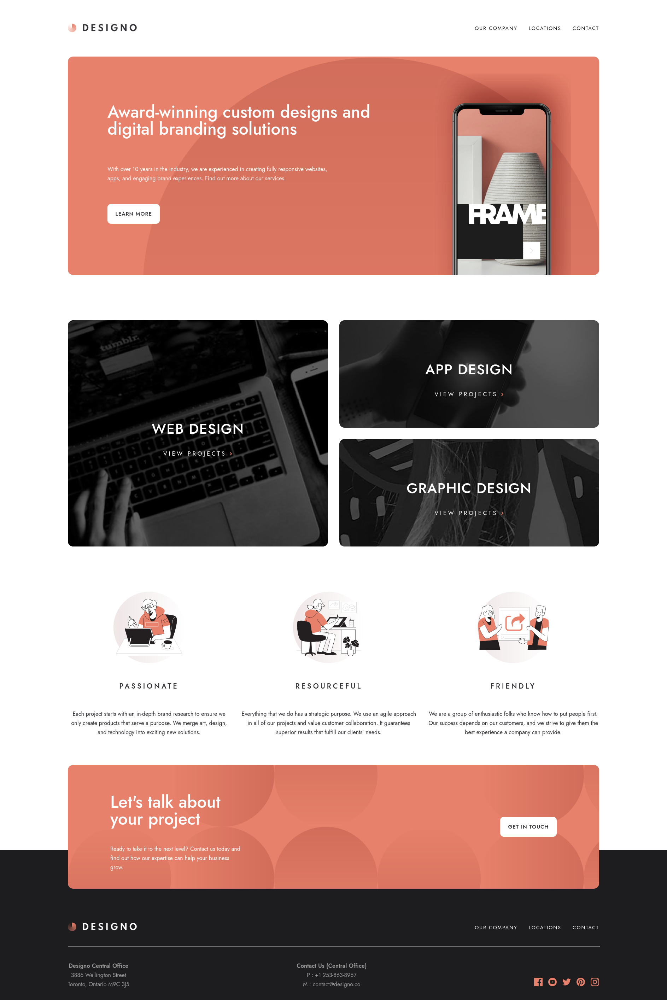

# Frontend Mentor - Designo agency website solution

This is a solution to the [Designo agency website challenge on Frontend Mentor](https://www.frontendmentor.io/challenges/designo-multipage-website-G48K6rfUT). Frontend Mentor challenges help you improve your coding skills by building realistic projects.

## Table of contents

- [Overview](#overview)
  - [The challenge](#the-challenge)
  - [Screenshot](#screenshot)
  - [Links](#links)
- [My process](#my-process)
  - [Built with](#built-with)
- [Author](#author)

## Overview

### The challenge

Users should be able to:

- View the optimal layout for each page depending on their device's screen size
- See hover states for all interactive elements throughout the site
- Receive an error message when the contact form is submitted if:
  - The `Name`, `Email Address` or `Your Message` fields are empty
  - The `Email Address` is not formatted correctly

### Screenshot

### Links

- Live Site URL: [Designo](https://imran94.github.io/designo)

## My process

### Built with

- Semantic HTML5 markup
- CSS custom properties
- Flexbox
- CSS Grid
- Mobile-first workflow

## Author

- Frontend Mentor - [@imran94](https://www.frontendmentor.io/profile/imran94)
